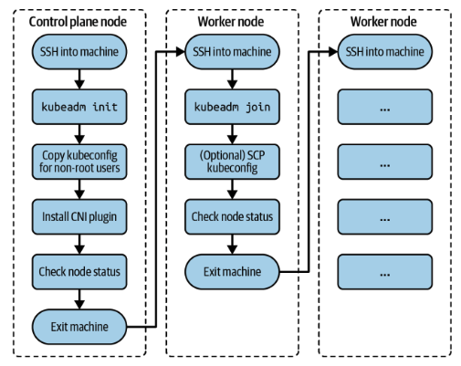
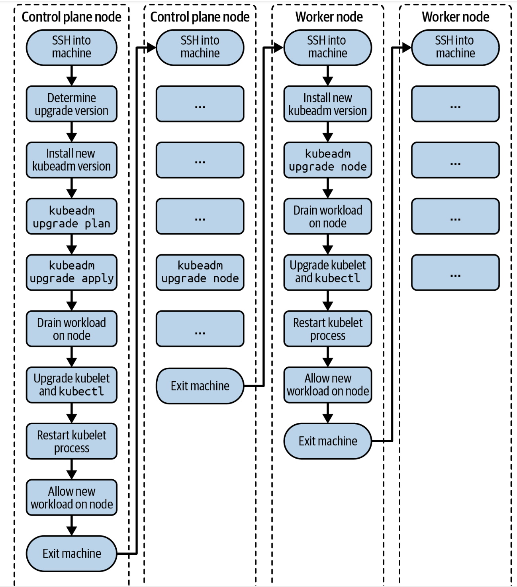

# CKA Notes

## Table of Contents
- [Installing a Cluster](#installing-a-cluster)
- [Upgrading a Cluster Version](#upgrading-a-cluster-version)
  - [Step 1: Upgrade Kubeadm](#step-1-upgrade-kubeadm)
  - [Step 2: Check Available Versions](#step-2-check-available-versions)
  - [Step 3: Apply the Upgrade](#step-3-apply-the-upgrade)
  - [Step 4: Drain the Control Plane Node](#step-4-drain-the-control-plane-node)
  - [Step 5: Upgrade Kubelet and Kubectl](#step-5-upgrade-kubelet-and-kubectl)
  - [Step 6: Restart Kubelet and Uncordon the Node](#step-6-restart-kubelet-and-uncordon-the-node)

## Installing a cluster

Basic topology consists of a single node acting as the control plane and the worker nodes.



## Upgrading a cluster version

It is recommended to upgrade from a minor version to a next higher one (e.g from 1.18.0 to 1.19.0), or from a patch version to a higher one (e.g from 1.18.0 to 1.18.3).



### Step 1: Upgrade Kubeadm

Start by upgrading the kubeadm version. 

```
$ sudo apt update
...
$ sudo apt-cache madison kubeadm
   kubeadm |  1.21.2-00 | http://apt.kubernetes.io kubernetes-xenial/main \
   amd64 Packages
   kubeadm |  1.21.1-00 | http://apt.kubernetes.io kubernetes-xenial/main \
   amd64 Packages
   kubeadm |  1.21.0-00 | http://apt.kubernetes.io kubernetes-xenial/main \
   amd64 Packages
   kubeadm |  1.20.8-00 | http://apt.kubernetes.io kubernetes-xenial/main \
   amd64 Packages
   kubeadm |  1.20.7-00 | http://apt.kubernetes.io kubernetes-xenial/main \
   amd64 Packages
   kubeadm |  1.20.6-00 | http://apt.kubernetes.io kubernetes-xenial/main \
   amd64 Packages
   kubeadm |  1.20.5-00 | http://apt.kubernetes.io kubernetes-xenial/main \
   amd64 Packages
   kubeadm |  1.20.4-00 | http://apt.kubernetes.io kubernetes-xenial/main \
   amd64 Packages
   kubeadm |  1.20.2-00 | http://apt.kubernetes.io kubernetes-xenial/main \
   amd64 Packages
   kubeadm |  1.20.1-00 | http://apt.kubernetes.io kubernetes-xenial/main \
   amd64 Packages
   kubeadm |  1.20.0-00 | http://apt.kubernetes.io kubernetes-xenial/main \
   amd64 Packages
...
```

### Step 2: Check Available Versions

Upgrade kubeadm to a target version.

```
$ sudo apt-mark unhold kubeadm && sudo apt-get update && sudo apt-get install \
  -y kubeadm=1.19.0-00 && sudo apt-mark hold kubeadm
Canceled hold on kubeadm.
...
Unpacking kubeadm (1.19.0-00) over (1.18.0-00) ...
Setting up kubeadm (1.19.0-00) ...
kubeadm set on hold.
$ sudo apt-get update && sudo apt-get install -y --allow-change-held-packages \
  kubeadm=1.19.0-00
...
kubeadm is already the newest version (1.19.0-00).
0 upgraded, 0 newly installed, 0 to remove and 7 not upgraded.
$ kubeadm version
kubeadm version: &version.Info{Major:"1", Minor:"19", GitVersion:"v1.19.0", \
GitCommit:"e19964183377d0ec2052d1f1fa930c4d7575bd50", GitTreeState:"clean", \
BuildDate:"2020-08-26T14:28:32Z", GoVersion:"go1.15", Compiler:"gc", \
Platform:"linux/amd64"}
```

### Step 3: Apply the Upgrade

Check which versions are available to upgrade to and validate whether your current cluster version is upgradable.

```
$ sudo kubeadm upgrade plan
...
[upgrade] Fetching available versions to upgrade to
[upgrade/versions] Cluster version: v1.18.20
[upgrade/versions] kubeadm version: v1.19.0
I0708 17:32:53.037895   17430 version.go:252] remote version is much newer: \
v1.21.2; falling back to: stable-1.19
[upgrade/versions] Latest stable version: v1.19.12
[upgrade/versions] Latest version in the v1.18 series: v1.18.20
...
You can now apply the upgrade by executing the following command:

	kubeadm upgrade apply v1.19.12

Note: Before you can perform this upgrade, you have to update kubeadm to v1.19.12.
...
```

```
$ sudo kubeadm upgrade apply v1.19.0
...
[upgrade/version] You have chosen to change the cluster version to "v1.19.0"
[upgrade/versions] Cluster version: v1.18.20
[upgrade/versions] kubeadm version: v1.19.0
...
[upgrade/successful] SUCCESS! Your cluster was upgraded to "v1.19.0". Enjoy!

[upgrade/kubelet] Now that your control plane is upgraded, please proceed \
with upgrading your kubelets if you haven't already done so.
```

### Step 4: Drain the Control Plane Node

Drain the control plane node by evicting the workload. Any new workload won’t be schedulable on the node until uncordoned:

```
$ kubectl drain kube-control-plane --ignore-daemonsets
node/kube-control-plane cordoned
WARNING: ignoring DaemonSet-managed Pods: kube-system/calico-node-qndb9, \
kube-system/kube-proxy-vpvms
evicting pod kube-system/calico-kube-controllers-65f8bc95db-krp72
evicting pod kube-system/coredns-f9fd979d6-2brkq
pod/calico-kube-controllers-65f8bc95db-krp72 evicted
pod/coredns-f9fd979d6-2brkq evicted
node/kube-control-plane evicted
```

### Step 5: Upgrade Kubelet and Kubectl

Upgrade the kubelet and the kubectl tool to the same version.

```
$ sudo apt-mark unhold kubelet kubectl && sudo apt-get update && sudo \
  apt-get install -y kubelet=1.19.0-00 kubectl=1.19.0-00 && sudo apt-mark \
  hold kubelet kubectl
...
Setting up kubelet (1.19.0-00) ...
Setting up kubectl (1.19.0-00) ...
kubelet set on hold.
kubectl set on hold.
```

### Step 6: Restart Kubelet and Uncordon the Node

Restart the kubectl process:

```
$ sudo systemctl daemon-reload
$ sudo systemctl restart kubelet
```

Reenable the control plane nodde back so that the new workload can become schedulable.

```
$ kubectl uncordon kube-control-plane
```

The control plane nodes should now show the usage of the new Kubernetes version.
